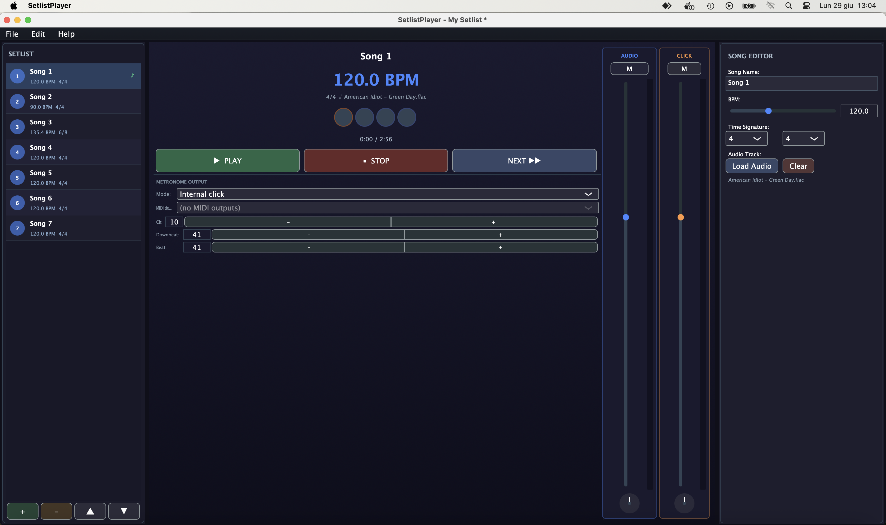

<div align="center">

# 🎶 SetlistPlayer

**Il compagno di palco per band, musicisti e performer.**
Gestisci la scaletta, lancia le basi e tieni il tempo — tutto da un'unica app, senza laptop ingombranti né mille programmi aperti.

*Costruito in C++ con [JUCE](https://juce.com) · macOS & iOS*

</div>

---

## 📸 Screenshot

<div align="center">



</div>

---

## Perché SetlistPlayer

Prima di salire sul palco hai una scaletta, le basi audio di ogni brano e un BPM da rispettare.
Di solito significa: un player per le basi, un metronomo a parte, un foglio con l'ordine dei pezzi e tanta tensione tra un brano e l'altro.

**SetlistPlayer mette tutto in un posto solo.** Costruisci la tua scaletta, associa una base ad ogni canzone, imposta tempo e metro, e durante il live ti basta premere **Play** e **Next**. Il metronomo parte già sincronizzato con la base, perfettamente a tempo, ogni volta.

---

## ✨ Funzionalità

- 🎼 **Gestione scaletta** — Lista ordinata dei brani con drag-and-drop, pulsanti ▲/▼, aggiungi e rimuovi al volo.
- 🎚️ **Player delle basi** — Riproduzione stereo di file **WAV, AIFF, MP3 e FLAC** con indicatore di posizione.
- 🎛️ **Mixer Audio / Click** — Fader indipendenti per base e metronomo, ciascuno con tasto **Mute**: dosa il click nelle in-ear senza toccare la base.
- 🥁 **Metronomo integrato** — Click sintetizzato con accento sul primo movimento, **perfettamente sincronizzato** con la base audio.
- 🎹 **Uscita MIDI** — Click MIDI opzionale con canale e note di downbeat/beat configurabili, da inviare a moduli, batterie elettroniche o in-ear.
- 💡 **Transport chiaro a colpo d'occhio** — BPM in grande, LED dei movimenti, Play / Stop / Next: tutto leggibile anche sotto le luci del palco.
- ✏️ **Editor del brano** — Nome, BPM (20–300), metro e base audio, modificabili per ogni canzone.
- 💾 **Progetti salvabili** — Salva l'intera scaletta in un file `.setlist` e riaprila quando vuoi.
- 📱 **macOS e iOS** — Stesso progetto, sul Mac in studio o sull'iPad sul palco.

---

## 🚀 Come iniziare

### Requisiti

| Strumento | Versione |
|-----------|----------|
| JUCE | 7.x |
| Xcode | 14+ |
| macOS | 10.13+ |
| C++ | 17 |

### Build

1. **Installa JUCE**
   ```bash
   git clone https://github.com/juce-framework/JUCE.git
   ```
2. **Apri il progetto** — Apri `SetlistPlayer.jucer` con **Projucer** e imposta il path dei moduli JUCE (es. `~/JUCE/modules`).
3. **Esporta e compila** — Clicca *"Save Project and Open in Xcode"*, seleziona lo schema **SetlistPlayer - Release** e premi **⌘B**.
   L'app sarà in `Builds/MacOSX/build/Release/`.

> ℹ️ Le cartelle `Builds/` e `JuceLibraryCode/` non sono versionate: vengono rigenerate da Projucer a partire dal file `.jucer`.

---

## 🎤 Come si usa

1. **Crea la scaletta** (⌘N) e aggiungi i brani (⌘T).
2. Per ogni brano imposta **nome, BPM e metro**, e carica la **base audio**.
3. Riordina i pezzi con drag-and-drop fino all'ordine del concerto.
4. Salva tutto (⌘S).
5. Sul palco: **Play** per partire, **Next** per il brano successivo. Il metronomo fa il resto.

### Scorciatoie

| Tasto | Azione |
|-------|--------|
| ⌘N | Nuovo progetto |
| ⌘O | Apri progetto |
| ⌘S | Salva |
| ⌘⇧S | Salva con nome |
| ⌘T | Aggiungi brano |
| ⌘Q | Esci |

---

## 🏗️ Architettura

```
MainComponent
├── SetlistPanel       (sinistra)  — lista brani, aggiungi/rimuovi/riordina
├── TransportPanel     (centro)    — BPM, LED dei movimenti, play/stop/next, volume
├── SongEditorPanel    (destra)    — dettagli del brano
├── MetronomeEngine    (AudioSource) — sintesi del click + uscita MIDI
├── AudioPlayerEngine  (AudioSource) — riproduzione della base
└── MixerSource        (AudioSource) — mix di metronomo + base verso l'uscita audio
```

I progetti sono salvati come `juce::ValueTree` serializzato:

```xml
<SetlistProject projectName="La mia scaletta">
  <Song name="Brano 1" bpm="120" beatsPerBar="4" beatUnit="4" audioFilePath="/path/base.wav"/>
  <Song name="Brano 2" bpm="95"  beatsPerBar="3" beatUnit="4" audioFilePath=""/>
</SetlistProject>
```

---

## 🛣️ Idee per il futuro

- **Count-in / pre-roll** prima dell'avvio della base
- Campi *note* e *tonalità* per ogni brano
- Esportazione della scaletta in PDF

---

<div align="center">

Realizzato con ❤️ da **Velena** · [www.velena.it](http://www.velena.it)

</div>
